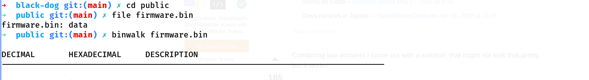
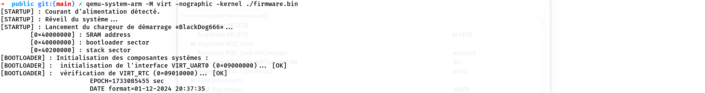
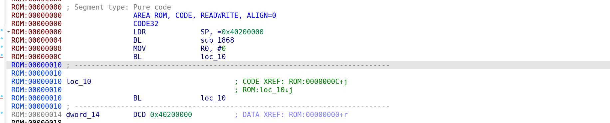
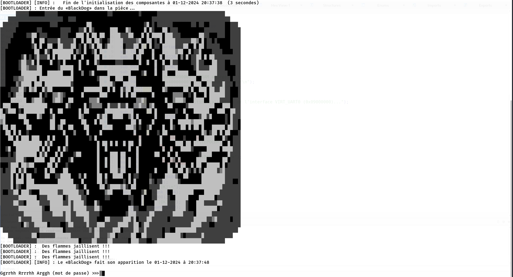
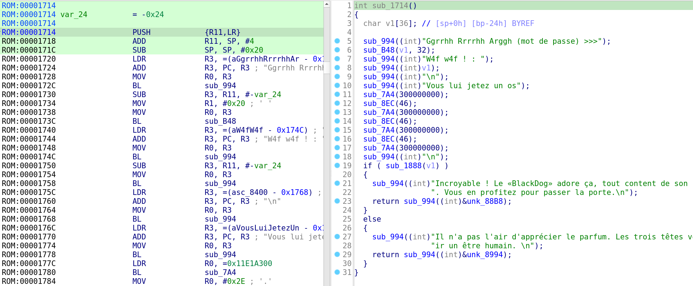

# Reverse : Black Dog

- **Auteur :** Matthias-hexwreaker
- **Catégorie :** reverse
- **Diffculté :** -
- **Points :** -
- **Points dynamiques :** oui
- **Indice 1 :**
```
- Ça sent l'ARM à plein nez ! Connaissez-vous Qemu ? L'outil permet d'émuler des machines virtuelles, comme la "virt" par exemple (ce n'est vraiment qu'un exemple ;)).
```

- **Remarques :**
```
Le firmware est "public/firmware.bin".

LES FICHIERS A DESTINATIONS DU CHALLENGERS SONT UNIQUEMENT CEUX SE TROUVANT DANS LE DOSSIER «/public»
```

- **Description :**
```
Titre : Extrait de la présentation sur les nouveaux dispositifs de sécurité dévellopés par la Fondation. 

« Les besoins en sécurité de l'information de la Fondation SCP sont primordiaux. C'est dans le but d'assurer la confidentialité, l'intégrité et la disponibilité des informations que la Fondation développe ses propres outils en interne.[blablabla...].»

« Toutes ces évolutions justifies la création de la nouvelle génération des boitiers de stockage sécurisé, dit "BlackDog 2.0". Ce boîtier doit permettre aux agents de stocker des informations confidentielles qui ne doivent être accessible que par son propriétaire. [blablabla...]. L'authentification se fait par mot de passe et aucune autre manière ne doit permettre d'accéder aux informations qui y sont stockées. »

« Les premiers boîtiers sont en cours de développement et les premiers prototypes sont déjà soumis à des audits de sécurité stricts, afin d'intégrer la sécurité dès la conception. »

FIN.

Un collègue vous a remis un de ces prototype "BlackDog" afin d'évaluer son niveau de sécurité. Sur le boîtier, un post-it indique : 
    
    « Tu n'y arriveras jamais ! On a passé des heures à sécuriser l'authentification ;) »

Vous prenez ce développeur de haut et commencez à péter son système dont il est si fier mouahahah !
Vous avez TRÉS hâte de lui annoncer à quel point son boîtier n'est pas sécurisé.
```

- **Documents fournies :**
```
    - firmware.bin
```


# Writeup

### Identification du fichier

La première étape consiste à télécharger le fichier «firmware.bin»... Ok !

Ensuite il convient d'identifier le fichier. Pour cela le reflex est d'utiliser les commandes **«file»** ou **«binwalk»**.
Cependant cela ne donne aucune information.



Dans ce cas il faut analyser manuellement le fichier, cela peut être fait avec un éditeur hexadécimal. Le nom du fichier donne déjà des indications sur sa raison d'être, à savoir un firmware d'un système embarqué.

Parallèlement, il est intéressant de rechercher des chaînes de caractères dans le fichier (commande **«strings»**).

```
➜  public git:(main) ✗ strings firmware.bin 
[STARTUP] : Courant d'alimentation d
tect
[STARTUP] : R
veil du syst
me...
[STARTUP] : Lancement du chargeur de d
marrage 
BlackDog666
        [0x40000000] : SRAM address
        [0x40000000] : bootloader sector
        [0x40200000] : stack sector
[BOOTLOADER] : Initialisation des composantes syst
mes :
[BOOTLOADER] :  initialisation de l'interface VIRT_UART0 (0x09000000)...
 [OK]
[BOOTLOADER] :  v
rification de VIRT_RTC (0x09010000)...
                        EPOCH=
 sec
                        DATE format=
[BOOTLOADER] :  v
rification de VIRT_FW_CFG (0x09020000)...
[BOOTLOADER] :  v
rification de VIRT_GPIO (0x09030000)...
[BOOTLOADER] :  v
rification de VIRT_UART1 (0x09040000)...
 [UNUSED]
[BOOTLOADER] :  v
rification de VIRT_SMMU (0x09050000)...
[BOOTLOADER] :  v
rification de VIRT_PCDIMM_ACPI (0x09070000)...
[BOOTLOADER] :  v
rification de VIRT_ACPI_GED (0x09080000)...
[BOOTLOADER] :  v
rification de VIRT_PVTIME (0x090a0000)...
[BOOTLOADER] :  v
rification de VIRT_MMIO (0x0a000000)...
[BOOTLOADER] :  v
rification de VIRT_PLATFORM_BUS (0x0c000000)...
[BOOTLOADER] :  v
rification de VIRT_SECURE_MEM (0x0e000000)...
[BOOTLOADER] :  v
rification de VIRT_PCIE_MMIO (0x10000000)...
[BOOTLOADER] [INFO] :   Fin de l'initialisation des composantes 
 secondes)
[BOOTLOADER] : Entr
e du 
BlackDog
 dans la pi
[BOOTLOADER] :  Des flammes jaillisent !!!
[BOOTLOADER] [INFO] : Le 
BlackDog
 fait son apparition le 
Ggrrhh Rrrrhh Arggh (mot de passe) >>>
W4f w4f ! : 
Vous lui jetez un os
Incroyable ! Le 
BlackDog
 adore 
a, tout content de son nouveau jouet il ne fait plus attention 
 vous. Vous en profitez pour passer la porte.
[32mLe flag est format
 comme ceci : 
AMSI{mot_de_passe_que_vous_avez_entr
Il n'a pas l'air d'appr
cier le parfum. Les trois t
tes vous regardent, se demandant quel go
t peut avoir un 
tre humain. 
[31mVous 
tes mort 
```

Les chaînes contenues dans le fichier donnent des informations très intéressantes. En effet, la chaîne «[BOOTLOADER] :  initialisation de l'interface VIRT_UART0 (0x09000000)» indique que le système s'appuie sur un chargeur de démarrage qui utilise le périphérique VIRT_UART0.

C'est déjà un bon point. Car connaître les périphériques utilisés et leurs adresses peut permettre d'identifier la carte sur laquelle le firmware s'exécute. Et après des recherches sur Internet les périphériques sont utilisé par la carte : QEMU_VIRT

Pour valider l'hypothèse il suffit d'essayer d'émuler le firmware avec la carte «virt» de qemu : 

    $ qemu-system-arm -M virt -nographic -kernel ./firmware.bin

Et cela fonctionne : 



##### Statique

Il est aussi possible d'identifier le firmware de manière statique.

Pour rappel un «firmware» (firm-ware = logiciel fermé) contient un ensemble d'instructions qui permettent le démarrage du système, il existe donc un point d'entrée et une architecture qu'il convient de déterminé.

Afin d'identifier l'architecture, il faut trouver une suite d'instruction logique dans un langage donné. Les systèmes embarqués utilisent souvent de l'ARM et nous cherchons à désassembler le code contenu dans le firmware.

Le désassembleur d'IDA permet d'analyser facilement le firmware.
Les points d'entrée en ARM sont souvent définie au début du firmware, ici c'est l'adresse 0x00000000 qui constitue notre point d'entrée.



Tout d'abord l'adresse de la pile devient 0x40200000.
Ensuite un branchement est effectué vers la fonction **«sub_1868»**.
Puis le système tombe dans une boucle infinie.

le firmware a été identifié et il suffit maintenant d'analyser son code pour comprendre ce qu'il fait.

### Analyse du code

En partant de la fonction trouvé précédemment, il est facile de retracer l'exécution du programme jusqu'à la phase d'authentification (vue lors de son exécution) :



La fonctionresponsable de l'authentification est celle-ci :



Le buffer **v1** contient l'entrée utilisateur qui est affiché à l'écran puis testée dans la fonction **«sub_1888»**

Cette fonction contient du code offusqué avec llvm par subsitutions d'instruction (voir https://github.com/obfuscator-llvm/obfuscator/wiki/Instructions-Substitution).

Il est assez facile de retrouver chaque comparaison de caractère dans le code malgré l'offuscation.

Le mot de passe est : **z3Bl4cKD0GW1llByt3Yu_Aarrrgh**

